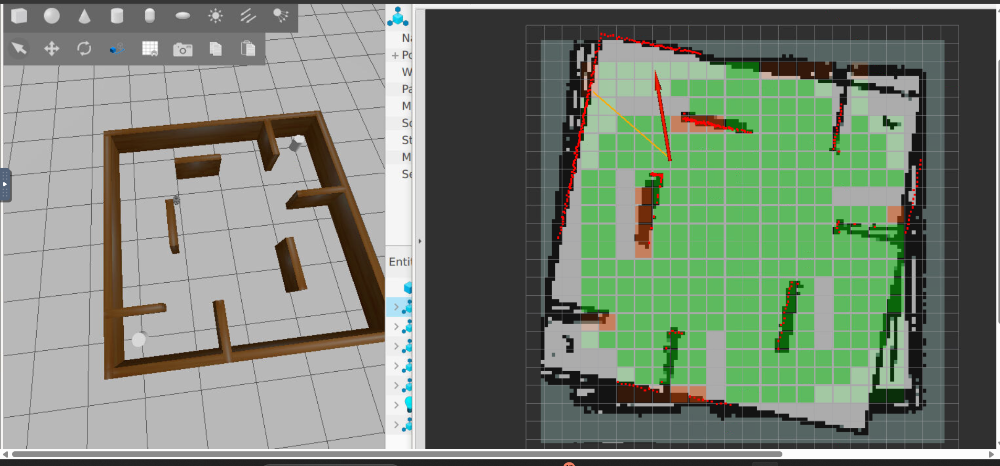
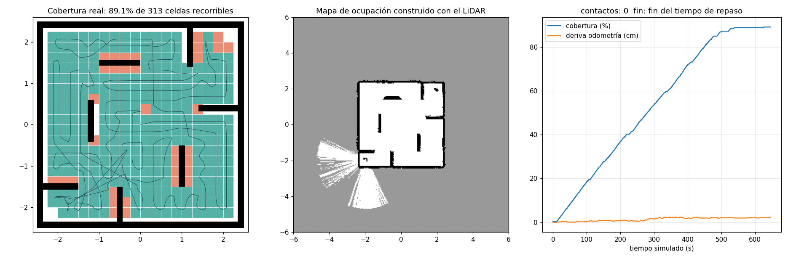
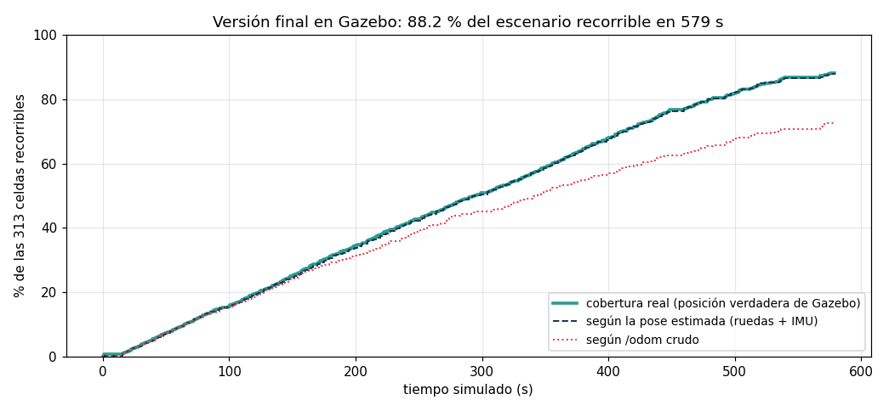
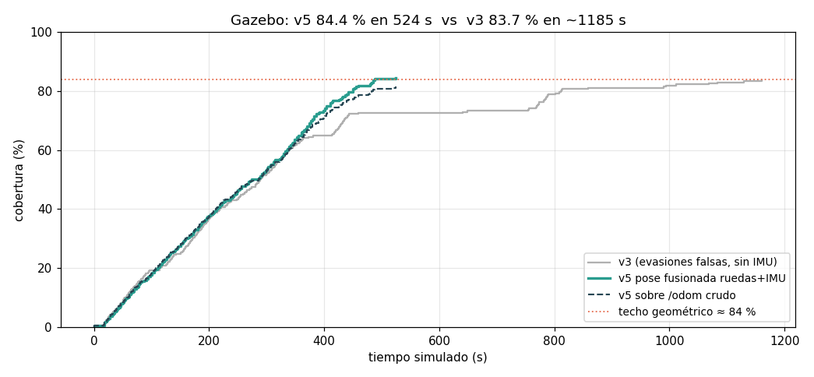

#Desafío Gazebo ROS 2

**Proyecto de Robots II · PRIA** — Milton Pozzo  
**Plataforma:** ROS 2 Jazzy · Gazebo Harmonic · TurtleBot3 Burger · escenario `turtlebot3_dqn_stage4`

## Video de demostración

▶ **[Ver el video de funcionamiento](https://drive.google.com/file/d/1mUG_Ewhf2dwaMcfdZRTcQRkf8U__s1j2/view?usp=sharing)**

El video muestra una misión completa en Gazebo: el robot arranca en pausa, reconoce su entorno con un giro inicial y recorre el escenario de forma autónoma. En RViz se ve el mapa construido con el LiDAR y las celdas visitadas, y en la terminal la matriz de cobertura actualizándose en vivo hasta el cartel de "MISIÓN TERMINADA" con el resultado final.

## Resumen

Este paquete resuelve el Desafío Gazebo ROS 2: un TurtleBot3 Burger que, partiendo del centro del escenario, recorre de forma autónoma la mayor superficie posible y se detiene solo cuando ya no queda nada alcanzable por monitorear.

El robot **no tiene ningún dato precargado del escenario**: no conoce su tamaño, ni dónde están las paredes, ni qué zonas son transitables. Lo descubre todo durante la misión. Construye un mapa con el LiDAR, estima su posición combinando la odometría de ruedas con la IMU, decide en cada momento qué zona le conviene visitar a continuación y controla su movimiento con una capa de seguridad que siempre tiene la última palabra. No hay teleoperación ni secuencias temporizadas: cada decisión depende de lo que los sensores informan en ese instante.

Para saber qué porcentaje del escenario se monitoreó hace falta, en cambio, alguien que sí lo conozca. Ese papel lo cumple un nodo "juez" independiente, que lee el mismo archivo de mundo que usa Gazebo, calcula cuántas celdas de 25 cm son realmente recorribles (313) y compara contra la posición verdadera del robot. Nada de lo que calcula el juez vuelve al robot.

En Gazebo, la versión final cubrió **entre el 87.9 y el 88.2 % del escenario recorrible** en tres corridas (276 de 313 celdas en la mejor), en unos 10 minutos de simulación, sin contactos y con un error medio de localización de 1.8 cm.

El documento empieza por lo necesario para instalar y ejecutar el paquete. Sigue con la arquitectura, cuenta después cómo se llegó a esta solución (buena parte del trabajo consistió en descubrir problemas que no eran evidentes al principio) y cierra con los resultados y con la correspondencia entre la solución y la consigna.

---

## 1. Dependencias

El paquete se usa dentro del contenedor de la materia ([ros2_jazzy_docker](https://github.com/sbarcelona11/ros2_jazzy_docker)), que ya trae ROS 2 Jazzy, Gazebo Harmonic y `ros_gz`. Además hace falta el paquete de simulación de TurtleBot3, que aporta el robot y el escenario:

```bash
sudo apt update && sudo apt install -y ros-jazzy-turtlebot3-gazebo
```

Lo instalado a mano con `apt` se pierde cada vez que el contenedor se recrea. Para que quede de forma permanente, conviene agregar la línea al `.devcontainer/Dockerfile`, junto a los demás paquetes `ros-jazzy-*`, y reconstruir el contenedor:

```dockerfile
    ros-jazzy-turtlebot3-gazebo \
```

El escenario descarga el modelo del piso desde Gazebo Fuel, así que la primera ejecución necesita conexión a internet. Las dependencias de Python (`rclpy`, `numpy`) ya vienen en la imagen. `matplotlib` solo hace falta para las figuras del simulador 2D opcional (`sudo apt install python3-matplotlib`).

## 2. Compilación

Clonar el repositorio dentro de `ros2_ws/src/`, con el nombre del paquete como carpeta:

```bash
cd /ros2_ws/src
git clone https://github.com/IngMiltonPozzo/ProyectoRobot2_TPFinal.git tb3_cobertura
```

Y compilar, en una terminal del contenedor:

```bash
cd /ros2_ws
source /opt/ros/jazzy/setup.bash
colcon build --symlink-install --packages-select tb3_cobertura
source install/setup.bash
```

## 3. Ejecución

### Ejecución normal

Un solo comando levanta el escenario, el robot, el puente ROS-Gazebo y los nodos de la misión:

```bash
ros2 launch tb3_cobertura mision.launch.py rviz:=true
```

La interfaz gráfica se ve en el navegador, en `http://localhost:6080/vnc.html`. La misión arranca sola unos segundos después de abrir Gazebo: primero el robot gira una vuelta completa para reconocer su entorno y luego empieza el recorrido. Al terminar se publica `/mision/fin`, el robot se detiene y el registro muestra una línea `RESULTADO FINAL` con la cobertura real, la cobertura según la pose estimada por el robot, la cobertura según la odometría cruda y el error de localización. Cada corrida deja además un CSV en `ros2_ws/src/resultados_cobertura/`, visible desde el sistema anfitrión.

Argumentos disponibles:

| Argumento | Por defecto | Efecto |
|---|---|---|
| `rviz` | `false` | abre RViz con el mapa del LiDAR, el barrido, el camino y las celdas |
| `pausado` | `false` | Gazebo arranca en pausa; la misión espera hasta que se le da play |
| `terminal_matriz` | `false` | abre una terminal con la matriz de cobertura actualizándose en el lugar |
| `vista_superior` | `true` | Gazebo abre con la cámara desde arriba y el panel *Visualize Lidar* agregado |
| `validar` | `true` | puentea la posición verdadera de Gazebo para que el juez mida la cobertura real |
| `obstaculos_moviles` | `false` | activa el movimiento de los dos cilindros del escenario (prueba de robustez) |
| `retardo` | `8.0` | segundos reales de espera antes de iniciar los nodos de la misión |

### Para grabar la demostración

El launch puede dejar todo preparado y en pausa, para acomodar las ventanas antes de empezar:

```bash
# 1. detener y limpiar cualquier ejecución anterior (Ctrl+C en el launch y luego:)
pkill -9 -f "ros2 launch"; pkill -9 -f "gz sim"; pkill -9 -f ruby; pkill -9 -f parameter_bridge
pkill -9 -f robot_state_publisher; pkill -9 -f rviz2; pkill -9 -f watch
pkill -9 -f navegador; pkill -9 -f monitor

# 2. lanzar en pausa
cd /ros2_ws && source install/setup.bash
ros2 launch tb3_cobertura mision.launch.py rviz:=true pausado:=true terminal_matriz:=true

# 3. con todo acomodado y la grabación iniciada, desde otra terminal:
gz service -s /world/dqn/control --reqtype gz.msgs.WorldControl --reptype gz.msgs.Boolean \
  --timeout 3000 --req 'pause: false'
```

Mientras la simulación está en pausa el robot no se mueve y el mapa de RViz permanece vacío, porque la misión corre sobre el reloj de Gazebo. La terminal de la matriz muestra el escenario visto desde arriba: 0 son celdas no recorribles, 1 las pendientes y 2 las visitadas. Al finalizar aparece un cartel de "MISIÓN TERMINADA" con el resultado. La misión también puede iniciarse con el botón ▶ de Gazebo.

## 4. Arquitectura

```
   /scan (LiDAR, 5 Hz)       /odom (ruedas, 30 Hz)      /imu (200 Hz)
          │                          │                        │
   ┌──────▼──────────────────────────▼────────────────────────▼──────┐
   │                       navegador_cobertura                        │
   │                                                                  │
   │  LOCALIZACIÓN  fusion.py                                         │
   │    traslación de las ruedas + rumbo de la IMU                    │
   │    publica la corrección como TF map → odom                      │
   │                                                                  │
   │  PERCEPCIÓN    mapa_ocupacion.py                                 │
   │    mapa de 12 × 12 m que empieza vacío, celdas de 5 cm           │
   │    log-odds con ray-tracing; lo desconocido cuenta como posible  │
   │    obstáculo; distancia de cada punto al obstáculo más cercano   │
   │    detección y seguimiento de obstáculos móviles                 │
   │                                                                  │
   │  DECISIÓN      planificador.py + mision.py                       │
   │    grilla propia de 25 cm anclada en el punto de partida         │
   │    candidatas: celdas donde el LiDAR mostró un punto libre       │
   │      en el que entra el robot                                    │
   │    Dijkstra → costo = distancia + giro − premio de "borde"       │
   │    máquina de estados: INICIO → PLANIFICAR → SEGUIR              │
   │      ⇄ EVADIR / RECUPERAR → FIN                                  │
   │                                                                  │
   │  CONTROL       mision.py                                         │
   │    seguimiento de waypoints (control P de rumbo)                 │
   │    rampas de velocidad; capa de seguridad final                  │
   └──────────────────────────────┬───────────────────────────────────┘
                                  │ /cmd_vel (TwistStamped)
                                  ▼
                            Gazebo (DiffDrive)

   monitor_cobertura — juez independiente (el robot no ve nada de esto)
     lee el .world de Gazebo → 313 celdas recorribles de 25 cm
     cobertura sobre la posición verdadera (resultado), la pose
     estimada y /odom crudo (comparación); matriz, CSV, marcadores
```

La lógica de percepción, decisión y control está escrita en módulos de Python que no dependen de ROS; los nodos son envoltorios finos a su alrededor. Esa separación permitió validar cada cambio en un simulador 2D propio (`herramientas/sim2d.py`) y con pruebas automáticas, sin necesidad de levantar Gazebo.

### Tópicos

| Tópico | Tipo | Uso |
|---|---|---|
| `/scan` | sensor_msgs/LaserScan | entrada: LiDAR |
| `/odom` | nav_msgs/Odometry | entrada: odometría de ruedas |
| `/imu` | sensor_msgs/Imu | entrada: rumbo inercial |
| `/cmd_vel` | geometry_msgs/TwistStamped | salida: comandos de velocidad |
| `/tf` (`map → odom`) | tf2_msgs/TFMessage | corrección de la odometría, para visualizar en la pose corregida |
| `/cobertura/pose` | nav_msgs/Odometry | pose estimada (ruedas + IMU) |
| `/cobertura/mapa_lidar` | nav_msgs/OccupancyGrid | mapa construido con el LiDAR |
| `/cobertura/camino` | nav_msgs/Path | camino planificado |
| `/cobertura/estado` | std_msgs/String | estado de la máquina y objetivo actual |
| `/mision/fin` | std_msgs/Bool | fin de la misión |
| `/cobertura/porcentaje` | std_msgs/Float32 | cobertura medida por el juez |
| `/cobertura/celdas` | visualization_msgs/MarkerArray | celdas recorribles del juez, para RViz |
| `/verdad/poses` | tf2_msgs/TFMessage | posición verdadera de Gazebo; solo la usa el juez |

## 5. Cómo se llegó a esta solución

### Entender el escenario y lo que se mide

El primer paso fue entender el escenario y el criterio de éxito. La consigna remite a un video y a un código de referencia. Por su geometría, el escenario del video y el de la matriz que usa ese código es `turtlebot3_dqn_stage4`: un recinto cuadrado de unos 4.7 m de lado, con siete paredes interiores y dos cilindros. El robot parte del centro.

El código de referencia mide la cobertura con una matriz de celdas que cuentan cuando el centro del robot pasa por ellas. Las primeras versiones usaron esa matriz tal cual, tanto para medir como para decidir qué celdas visitar. Al superponerla con la geometría real del mundo apareció un problema: no coinciden del todo. Varias paredes interiores están corridas alrededor de una celda, algunas celdas marcadas como libres caen dentro de paredes reales y hay piso libre que la matriz marca como pared. Además, su indexación trunca hacia cero y hace que la celda central mida medio metro. Durante un tiempo traté esas diferencias como una restricción más del problema. Más adelante, como se cuenta al final de esta sección, tomé la decisión contraria: el código de referencia es una guía y no tiene por qué limitar la solución.

Para las interfaces verifiqué con las herramientas de ROS y de Gazebo lo que el robot publica y espera. En Jazzy, `/cmd_vel` usa `TwistStamped`. El LiDAR entrega 360 muestras a 5 Hz con un alcance de 0.12 a 3.5 m, y está montado 3.2 cm detrás del eje de las ruedas. La odometría proviene de las ruedas y la IMU publica a 200 Hz.

### La primera arquitectura

Con esa base armé la estructura clásica de percepción, decisión y control. La percepción es un mapa de ocupación de 5 cm por celda, que se actualiza con cada barrido del LiDAR trazando los rayos: lo que un rayo atraviesa se vuelve libre y donde impacta se vuelve ocupado, de modo que el mapa se corrige solo si algo cambia. A partir de ese mapa se calcula, para cada punto, la distancia al obstáculo más cercano. Esa distancia permite planificar con margen y elegir, dentro de cada celda por visitar, el punto más seguro para pisarla.

La decisión la toma un planificador que calcula con Dijkstra la distancia real hasta todas las celdas pendientes. Elige la siguiente con un costo que combina la distancia, cuánto hay que girar y un premio para las celdas que quedan "en el borde" de lo ya visitado. Ese premio evita dejar huecos aislados que después obligan a volver, y produce un recorrido parecido a un barrido, aunque nadie le indica al robot que barra en franjas. Descarté un barrido clásico en franjas porque las paredes interiores cortan cualquier franja y obligarían a descomponer el espacio en sectores. Con una decisión codiciosa que se replanifica en cada celda, las paredes y los obstáculos se manejan solos.

Una máquina de estados coordina el giro inicial para reconocer el entorno, el seguimiento del camino, las maniobras de recuperación cuando no hay progreso y el cierre de la misión. Por encima de todo actúa una capa de seguridad que frena ante cualquier obstáculo cercano adelante, impide avanzar si algo roza de costado y vigila la parte trasera al retroceder, sin importar lo que haya decidido el resto.

Desde el principio separé la lógica de ROS. Esa decisión resultó muy útil, porque me permitió escribir un simulador 2D del escenario y probar cada cambio en segundos, antes de llevarlo a Gazebo, donde una corrida completa lleva más de diez minutos.

### Lo que Gazebo enseñó

La primera corrida en Gazebo funcionó, pero el robot entraba una y otra vez en modo de evasión sin tener nada cerca. Al principio pensé que eran los cilindros del escenario. Mirando la simulación noté que estaban quietos en sus esquinas: el plugin que debía moverlos no cargaba, porque el paquete de Jazzy lo instala en una carpeta que Gazebo no revisa. Eso tuvo una consecuencia importante. La matriz de referencia tiene bloqueadas justamente las celdas de las posiciones iniciales de los cilindros, y en el video de referencia también aparecen quietos, así que el escenario de evaluación es con los cilindros detenidos. El launch los deja así por defecto y ofrece `obstaculos_moviles:=true`, que corrige la ruta del plugin, para probar la solución con obstáculos en movimiento. En ese modo se observó además que el plugin hace que los cilindros se hundan y reaparezcan en el piso, porque el modelo es dinámico y la gravedad actúa entre teletransportes.

Si no había nada moviéndose, ¿qué estaba esquivando el robot? Agregué un registro que, en cada evasión, informa dónde cree el robot que está el obstáculo y a qué velocidad se mueve. Crucé esas posiciones con los planos del escenario y todas correspondían a bordes de paredes. El mecanismo era sutil. Cuando el robot se desplaza ve partes distintas de una misma pared, y el centro de lo que ve "se desliza" aunque la pared esté quieta. A eso se sumaba un pequeño desfase entre el instante del barrido y la pose asociada, que al girar hace aparecer la pared corrida hacia espacio que antes estaba libre. Corregí el problema en tres niveles: el nodo interpola la pose al instante exacto de cada barrido; los barridos tomados mientras el robot gira rápido no se integran al mapa; y un obstáculo solo se considera móvil si muestra un avance neto sostenido, de al menos 8 cm en medio segundo, lejos de cualquier pared firme del mapa. Una pared puede "temblar", pero no se traslada. Con esos cambios las evasiones falsas desaparecieron y el tiempo de la misión bajó a menos de la mitad. Además, cuando el escenario se lanza con los cilindros quietos, la reacción a obstáculos móviles directamente se desactiva, porque no hay nada que se mueva; el mapa y la capa de seguridad siguen protegiendo al robot.

### La deriva que no se veía en los números

La corrida siguiente dio un 92 % de cobertura según la matriz de referencia, un número que no podía ser cierto porque superaba lo físicamente alcanzable. RViz mostró la causa: el mapa construido con el LiDAR estaba rotado varios grados respecto de la grilla. Al girar en el lugar, las ruedas del robot patinan levemente y la odometría acumula error de rumbo. A partir de ese momento el robot "vive" en un mundo girado, y una métrica calculada sobre `/odom` cuenta celdas en lugares donde el robot nunca estuvo.



Reproduje el efecto en el simulador agregando un patinamiento del 1 % y obtuve exactamente el mismo patrón: la métrica sobre la odometría subía por encima del 90 %, mientras la cobertura real caía a alrededor del 72 %. La solución vino de un sensor que el robot ya tenía. La IMU mide el giro con un giróscopo que no se ve afectado por el patinamiento. Combiné ambas fuentes: la traslación sale de las ruedas, que en tramos rectos son confiables, y la orientación sale de la IMU. Además suavicé los giros con rampas de aceleración, para que las ruedas patinen menos desde el origen.

La corrección se publica como una transformación `map → odom`, del mismo modo que lo hace un nodo de localización estándar. Así RViz dibuja el barrido, el robot, el mapa y las celdas en la pose corregida y no en la de las ruedas, que con el correr de la misión termina desviándose visiblemente.

Quedaba una pregunta de fondo: si `/odom` no es confiable, ¿cómo saber cuánto cubre realmente el robot? Para responderla, el monitor calcula la cobertura sobre tres fuentes de posición: la odometría cruda, la pose estimada por el robot y la posición verdadera que publica Gazebo. Esta última se lee únicamente para medir, y la navegación nunca la consulta. Las pruebas posteriores mostraron que la pose estimada se mantiene a menos de 4 cm de la verdad durante toda la misión, mientras que la odometría sola llega a subestimar la cobertura en más de 15 puntos.

### Un robot que no sabe nada del escenario

Con la localización resuelta, revisé con más cuidado qué sabía el robot antes de empezar. Las paredes ya se descubrían con el LiDAR, pero quedaban dos conocimientos previos. El planificador elegía sus destinos de la matriz del código de referencia, es decir, sabía de antemano dónde había piso para recorrer. Y el mapa tenía un tamaño fijo de 5.6 m centrado en el punto de partida, una forma silenciosa de suponer cuánto medía el escenario. Ninguna de las dos cosas era aceptable si el robot debía descubrir el escenario por su cuenta.

El cambio separó dos papeles que hasta entonces estaban mezclados. El robot lleva su propia cuenta en una grilla regular de 25 cm anclada en su posición inicial, sobre un mapa de 12 × 12 m que empieza vacío. En cada decisión mira lo descubierto hasta ese momento: una celda pasa a ser candidata cuando el LiDAR mostró en ella un punto libre donde entra el cuerpo del robot. A medida que explora aparecen nuevas candidatas, y la misión termina cuando no queda ninguna alcanzable. La evaluación quedó a cargo del monitor, que actúa como juez. Lee el archivo del mundo con sus paredes y cilindros, calcula las celdas donde el centro del robot puede estar sin chocar y a las que se puede llegar desde el inicio (313 en este escenario), y mide cuántas de ellas pisó el robot según su posición verdadera. Un test automático verifica que ningún módulo de la navegación importe datos del escenario.

Liberar al robot de la matriz tuvo un efecto inmediato: empezó a recorrer el piso libre que antes ignoraba y la cobertura real subió varios puntos. También dejó al descubierto un problema que la matriz ocultaba. Como la matriz excluía las celdas alrededor de los cilindros, antes el robot nunca se les acercaba; ahora, al ir hacia ellas, en el simulador rozaba de vez en cuando uno. La causa era que el LiDAR solo ve la cara del cilindro que tiene enfrente, y el cálculo de distancias ignoraba la parte no observada. La corrección fue tratar lo desconocido como posible obstáculo al medir distancias. Por último, a la fase de repaso final, que reintenta las celdas pegadas a las paredes con un margen algo menor y más despacio, le puse un límite de un minuto: sin él se estiraba varios minutos para ganar muy poco.

### Márgenes y límites de la cobertura

Las celdas que el robot no visita están todas pegadas a paredes o a los cilindros. Para aceptar un punto como destino, el planificador exige dos márgenes a la vez: que el centro del robot quede a 16 cm o más de cualquier obstáculo, para que el cuerpo no roce ni siquiera al girar, y que el punto quede al menos 3 cm adentro de su celda, para que el error de localización no haga que el robot pise en realidad la celda vecina. En las celdas donde la franja libre es más angosta que la suma de ambos márgenes no existe ningún punto válido, y el robot las descarta. En el simulador probé reducir los márgenes y la cobertura subió algunos puntos, pero a costa de roces ocasionales y de un repaso mucho más largo. Preferí priorizar la seguridad, que es uno de los criterios de la consigna.

### Detalles de la demostración

Preparar el video dejó algunos aprendizajes. El launch puede arrancar Gazebo en pausa, con la cámara desde arriba (orientada como RViz) y con una terminal que muestra la matriz de cobertura actualizándose en el lugar, más un cartel final con el resultado. Al probarlo en pausa, el mapa a veces aparecía ya dibujado antes de iniciar la misión. Primero apareció incluso con paredes que el robot no podía ver desde el centro: resultó ser el mapa de un nodo de una corrida anterior que había quedado vivo, y la solución fue limpiar todos los procesos antes de relanzar (§3). Descartado eso, quedaba otro efecto real: al inicializarse, Gazebo publica algún barrido del LiDAR aunque esté en pausa, y según los tiempos de arranque el navegador llegaba o no a recibirlo. Para que el comportamiento no dependa de la suerte, el navegador descarta los barridos hasta que el tiempo de simulación avanza medio segundo. Así el mapa arranca siempre vacío y se construye a la vista durante el giro inicial.

El panel de Gazebo que dibuja los rayos del LiDAR (*Visualize Lidar*) los mostraba saliendo del centro del escenario en lugar del robot. Primero sospeché del nombre del marco del sensor, que el modelo oficial renombra a `base_scan`, y descarté esa hipótesis inspeccionando los mensajes con `gz topic`: Gazebo publica el nombre completo del sensor. La causa real apareció al comparar el tópico declarado en el modelo del robot (`scan`) con el que busca el panel (`/scan`). Para Gazebo son el mismo tópico, pero el panel compara los textos literalmente y no encuentra el sensor, como indicaba su propio mensaje de error. El launch carga el robot desde una copia del modelo oficial en la que solo cambia ese texto; el resto del modelo queda intacto. Con ese cambio desapareció el error del panel. En cualquier caso, la navegación nunca dependió de ese dibujo: RViz siempre mostró el barrido en su posición real.

### Parámetros

Todos los umbrales son parámetros ROS, definidos en `config/parametros.yaml`. Los principales:

| Grupo | Parámetros | Valores |
|---|---|---|
| Movimiento | `v_max`, `w_max`, `acel_v`, `acel_w` | 0.20 m/s, 1.2 rad/s, 0.5 m/s², 2.5 rad/s² |
| Seguridad (desde el LiDAR) | `d_stop`, `d_lento`, `d_lateral` | 0.17 m, 0.40 m, 0.12 m |
| Planificación | `r_paso`, `r_objetivo`, `margen_celda` | 0.16 m, 0.16 m, 0.03 m |
| Repaso final | `r_repaso`, `v_repaso`, `t_repaso_max` | 0.15 m, 0.10 m/s, 60 s |
| Localización | `usar_imu` | `true` |
| Obstáculos móviles | `d_peligro`, `horizonte`, `min_desp_movil`, `d_pared_movil` | 0.42 m, 3 s, 0.08 m, 0.15 m |
| Juez | `radio_robot` | 0.13 m |

## 6. Resultados

### En el simulador 2D

Antes de cada prueba en Gazebo validé los cambios en el simulador, que reproduce la geometría del escenario, el LiDAR, los cilindros (con su capacidad de empujar al robot), el desfase entre sensores y la deriva de la odometría. Con la versión final y los cilindros quietos, en tres corridas con distintos niveles de deriva, la cobertura real fue de 88.5 a 89.1 % de las 313 celdas recorribles, en unos 650 s y sin contactos. Con los cilindros en movimiento la cobertura baja a alrededor del 82 %, porque esos cilindros pueden empujar al robot y ese desplazamiento no lo registra ningún sensor propio.



Para reproducirlo:

```bash
cd /ros2_ws/src/tb3_cobertura
python3 herramientas/sim2d.py --tiempo 1100 --png resultado.png
python3 herramientas/sim2d.py --obst-quietos --desfase 0.05 --patinamiento 0.005
python3 -m pytest -q test
```

### En Gazebo

La tabla resume la evolución de las corridas completas, con los cilindros quietos. Las versiones v3 a v6 todavía usaban la matriz del código de referencia, tanto para elegir destinos como para medir, así que sus porcentajes se calculan sobre sus 270 celdas y no son directamente comparables con la versión final, que se mide sobre las 313 celdas recorribles reales.

| Versión | Cobertura real | Según `/odom` crudo | Tiempo | Qué cambió |
|---|---|---|---|---|
| v3 | — | 83.7 % (matriz) | 1185 s | primera corrida completa; ~150 evasiones falsas junto a paredes |
| v4 | — | 92.2 % ✗ (matriz) | 528 s | sin evasiones falsas, pero con el mapa rotado por la deriva |
| v5 | 84.8 % (pose estimada, matriz) | 81.5 % | 537 s | fusión de ruedas e IMU; mapa alineado |
| v6 | 83.0 % (verdad Gazebo, matriz) | 66.3 % | 516 s | validación contra la posición verdadera |
| **final** | **87.9–88.2 %** de 313 (verdad Gazebo) | 72.5–74.1 % | **~580 s** | el robot no tiene datos del escenario; el juez mide sobre el escenario real |

En la mejor corrida de la versión final el robot cubrió el **88.2 % del escenario recorrible real**, 276 de las 313 celdas. Pasó el 50 % a los 294 s de simulación, el 80 % a los 482 s y el 85 % a los 528 s, y terminó solo cuando no quedaron candidatas alcanzables. La pose estimada se mantuvo en promedio a 1.8 cm de la posición verdadera, con un máximo de 3.6 cm, y por eso la cobertura según esa pose coincide con la real. La odometría de ruedas sola habría informado un 72.5 %. No hubo contactos con paredes ni cilindros.



La comparación entre la tercera y la quinta versión resume el efecto de las correcciones intermedias: la misma cobertura en menos de la mitad del tiempo.



## 7. Correspondencia con la consigna

**Etapas de desarrollo sugeridas.** Las seis etapas de la consigna se recorrieron en orden y varias veces. La comprensión del escenario incluyó identificar el mundo, la condición inicial y la discrepancia entre la matriz de referencia y la geometría real (§5). La identificación de interfaces verificó cada tópico y tipo de mensaje (§5 y tabla de tópicos). La percepción y la decisión y control son los módulos descritos en §4. La integración es un único launch reproducible (§3). Las pruebas y ajustes combinaron el simulador 2D con corridas en Gazebo, registrando cada falla y su corrección (§5 y §6).

**Criterios de aceptación.**

| Criterio | Cómo se cumple |
|---|---|
| Autonomía | La misión arranca, recorre y termina sola; no hay comandos manuales durante la ejecución. El único paso manual opcional es quitar la pausa de Gazebo para grabar. |
| Percepción efectiva | Todas las decisiones dependen de los sensores: el mapa, las celdas candidatas y los caminos salen del LiDAR; la posición, de las ruedas y la IMU; la capa de seguridad reacciona al barrido en cada ciclo. El robot no tiene datos precargados del escenario. |
| Cumplimiento de la misión | 87.9–88.2 % del escenario recorrible, medido contra la posición verdadera de Gazebo sobre las 313 celdas recorribles reales del mundo. |
| Seguridad y estabilidad | Márgenes de 16 cm a obstáculos, capa de seguridad frontal, lateral y trasera, rampas de velocidad y recuperación ante falta de progreso. Sin contactos en las corridas finales. |

**Entregables.**

| Entregable | Contenido |
|---|---|
| Código fuente | paquete `tb3_cobertura`: nodos, launch, configuración, RViz, simulador 2D y pruebas (§8) |
| README de ejecución | este documento: dependencias (§1), compilación (§2), lanzamiento (§3) y arquitectura (§4) |
| Video de demostración | [video de funcionamiento](https://drive.google.com/file/d/1mUG_Ewhf2dwaMcfdZRTcQRkf8U__s1j2/view?usp=sharing): ejecución en Gazebo con RViz y la matriz de cobertura en vivo, hasta el cartel de fin de misión |

## 8. Estructura

```
tb3_cobertura/
├── config/parametros.yaml       parámetros de la misión y del juez
├── launch/mision.launch.py      escenario, robot, puente, misión, RViz y presentación
├── rviz/cobertura.rviz          vista de RViz (marco fijo: map)
├── tb3_cobertura/
│   ├── nodo_navegador.py        nodo principal: localización, percepción, decisión, control
│   ├── nodo_monitor.py          nodo juez: evaluación, matriz, CSV, marcadores
│   ├── fusion.py                localización: ruedas + rumbo de la IMU
│   ├── mapa_ocupacion.py        mapa de ocupación del LiDAR
│   ├── planificador.py          selección de celdas y caminos (Dijkstra)
│   ├── mision.py                máquina de estados, control, seguridad, obstáculos móviles
│   ├── grilla_cobertura.py      grilla propia del robot (25 cm, sin datos del escenario)
│   └── escenario_verdad.py      juez: lee el .world y calcula las celdas recorribles
├── herramientas/sim2d.py        simulador 2D para validar sin Gazebo
├── test/test_logica.py          pruebas automáticas
└── docs/                        figuras y capturas de este documento
```

## 9. Problemas frecuentes

| Síntoma | Causa y solución |
|---|---|
| `Package 'turtlebot3_gazebo' not found` | Falta el paquete de TurtleBot3 (§1). Si antes funcionaba, el contenedor se recreó y se perdió lo instalado a mano; agregarlo al Dockerfile lo evita. |
| `Exec format error` al iniciar el navegador o el monitor | La compilación quedó inconsistente, en general después de recrear el contenedor. Compilar de cero: `rm -rf build/tb3_cobertura install/tb3_cobertura` y `colcon build`. |
| Se abren dos Gazebo, o el mapa aparece completo antes de empezar | Quedaron procesos de una ejecución anterior. Usar el bloque de limpieza completo de §3, que incluye `navegador` y `monitor`, y verificar con `ps aux`. |
| Los cilindros se mueven sin haberlo pedido | Quedó exportada a mano la variable `GZ_SIM_SYSTEM_PLUGIN_PATH`: `unset GZ_SIM_SYSTEM_PLUGIN_PATH` o abrir una terminal nueva. |
| `Failed to load system plugin [libobstacle1.so]` | Es esperable: los cilindros quedan quietos, que es el escenario de evaluación. |
| El robot no se mueve | Si se lanzó con `pausado:=true`, falta quitar la pausa (§3). Si no, verificar con `ros2 topic info /cmd_vel -v` que el tipo sea `TwistStamped`. |
| RViz no muestra el barrido o avisa que falta el marco `map` | En pausa es normal: la corrección `map → odom` se publica cuando empiezan a llegar datos. Si persiste después de iniciar, revisar que *Fixed Frame* sea `map`. |
| Gazebo muy lento | Sin GPU todo se dibuja por software. Cerrar ventanas y paneles que no se usen; la misión corre en tiempo de simulación, así que el resultado no cambia. |
| No se abre la terminal de la matriz | En otra terminal: `watch -t -n 0.5 cat /tmp/tb3_matriz.txt` |
